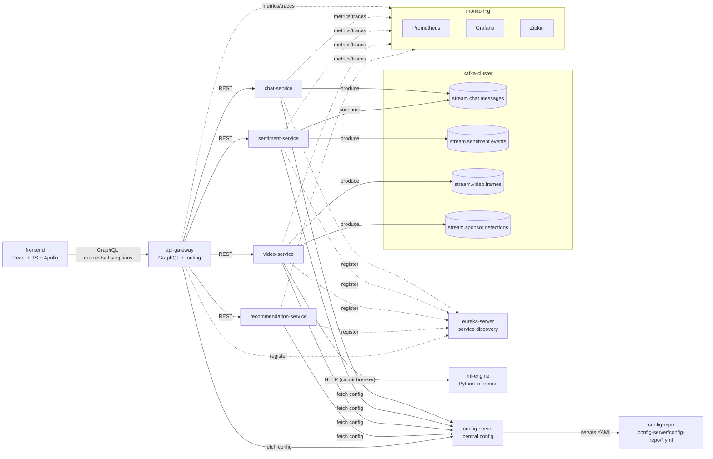

# StreamSense

**StreamSense** is a distributed microservices platform for **real‑time Twitch chat analytics**.  
It ingests chat messages, streams them through Kafka, processes them in backend services, and delivers live updates to a frontend dashboard via GraphQL subscriptions.

The project demonstrates a modern event‑driven architecture using Spring Boot microservices, Kafka streaming, and real‑time WebSocket delivery. Currently in the process of a full production port from V2 of Streamsense, rebuilding from the ground up with more optimal architectural principles, using all of the information gained from V1 and V2 iterations.

---

# Architecture Overview

## High-level diagram

## Services and their responsibilities

eureka-server: Service discovery registry for all Spring services.

config-server: Central configuration service (native file backend during local/dev).

api-gateway: Single entry point; routing + GraphQL (queries/subscriptions).

chat-service: Chat ingestion; produces stream.chat.messages.

sentiment-service: Consumes chat; produces stream.sentiment.events (stubbed early, real later).

video-service: Frame ingestion; sponsor detection via ML; produces stream.sponsor.detections.

recommendation-service: Aggregates signals into recommendation outputs.

kafka-cluster: Event backbone enabling decoupled async pipelines.

ml-engine: Containerized Python inference services (sentiment + sponsor).

monitoring: Prometheus + Grafana + Zipkin for metrics, dashboards, and tracing.

frontend: React dashboard consuming GraphQL queries/subscriptions.

# Key Features

### Real-Time Streaming
- Kafka event backbone
- Partitioned topics by streamer
- Low-latency event delivery

### GraphQL API
- Queries for health and system data
- Real-time **GraphQL subscriptions**
- WebSocket transport (`graphql-transport-ws`)

### Observability
- **Prometheus** metrics
- **Zipkin** distributed tracing
- Actuator health endpoints

### Microservices Architecture
- Spring Boot services
- Eureka service discovery
- Config Server centralized configuration

### Developer Friendly
- Docker Compose environment
- Embedded Kafka integration tests
- CI-friendly test design

---

# Technology Stack

Backend:

- Java 21
- Spring Boot
- Spring Cloud
- Spring GraphQL
- Apache Kafka
- Micrometer
- Zipkin

Infrastructure:

- Docker / Docker Compose
- Prometheus
- Kafka UI
- Eureka
- Config Server

Frontend:

- React
- Apollo Client
- GraphQL subscriptions

Testing:

- JUnit
- Embedded Kafka
- GraphQL test utilities
- Maven CI compatibility

---

# Running the Project

## Refer to /Docs folder

# License

MIT License
