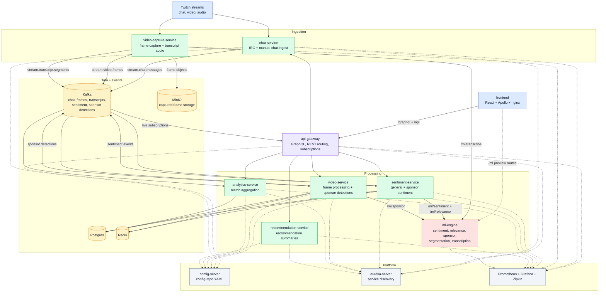

# StreamSense

StreamSense is a real-time sponsor analytics platform for Twitch streams. It ingests chat, video frames, and transcript segments; runs ML-backed sentiment, sponsor detection, segmentation, transcription, and relevance analysis; then exposes live results through GraphQL and the web console.


## Architecture


```mermaid
flowchart TB
  classDef client fill:#dbeafe,stroke:#2563eb,color:#0f172a
  classDef edge fill:#ede9fe,stroke:#7c3aed,color:#0f172a
  classDef service fill:#dcfce7,stroke:#16a34a,color:#0f172a
  classDef data fill:#fef3c7,stroke:#d97706,color:#0f172a
  classDef infra fill:#f1f5f9,stroke:#64748b,color:#0f172a
  classDef ml fill:#fee2e2,stroke:#dc2626,color:#0f172a

  TW[Twitch streams<br/>chat, video, audio]:::client
  FE[frontend<br/>React + Apollo + nginx]:::client
  GW[api-gateway<br/>GraphQL, REST routing, subscriptions]:::edge

  subgraph INGEST[Ingestion]
    CHAT[chat-service<br/>IRC + manual chat ingest]:::service
    CAP[video-capture-service<br/>frame capture + transcript audio]:::service
  end

  subgraph CORE[Processing]
    SENT[sentiment-service<br/>general + sponsor sentiment]:::service
    VIDEO[video-service<br/>frame processing + sponsor detections]:::service
    ANALYTICS[analytics-service<br/>metric aggregation]:::service
    RECO[recommendation-service<br/>recommendation summaries]:::service
    ML[ml-engine<br/>sentiment, relevance, sponsor,<br/>segmentation, transcription]:::ml
  end

  subgraph DATA[Data + Events]
    KAFKA[(Kafka<br/>chat, frames, transcripts,<br/>sentiment, sponsor detections)]:::data
    PG[(Postgres)]:::data
    REDIS[(Redis)]:::data
    MINIO[(MinIO<br/>captured frame storage)]:::data
  end

  subgraph PLATFORM[Platform]
    CONFIG[config-server<br/>config-repo YAML]:::infra
    EUREKA[eureka-server<br/>service discovery]:::infra
    OBS[Prometheus + Grafana + Zipkin]:::infra
  end

  FE -->|/graphql + /api| GW
  FE -.->|/ml preview routes| ML

  GW --> CHAT
  GW --> SENT
  GW --> VIDEO
  GW --> ANALYTICS
  GW --> RECO
  KAFKA -->|live subscriptions| GW

  TW --> CHAT
  TW --> CAP
  CHAT -->|stream.chat.messages| KAFKA
  CAP -->|frame objects| MINIO
  CAP -->|stream.video.frames| KAFKA
  CAP -->|/ml/transcribe| ML
  CAP -->|stream.transcript.segments| KAFKA

  KAFKA --> SENT
  SENT -->|/ml/sentiment + /ml/relevance| ML
  SENT -->|sentiment events| KAFKA
  SENT --> PG
  SENT --> REDIS

  KAFKA --> VIDEO
  VIDEO -->|/ml/sponsor| ML
  VIDEO -->|sponsor detections| KAFKA
  VIDEO --> PG
  VIDEO --> REDIS

  KAFKA --> ANALYTICS
  ANALYTICS --> PG

  GW -.-> CONFIG
  CHAT -.-> CONFIG
  SENT -.-> CONFIG
  VIDEO -.-> CONFIG
  ANALYTICS -.-> CONFIG
  RECO -.-> CONFIG

  GW -.-> EUREKA
  CHAT -.-> EUREKA
  SENT -.-> EUREKA
  VIDEO -.-> EUREKA
  ANALYTICS -.-> EUREKA
  RECO -.-> EUREKA

  GW -.-> OBS
  CHAT -.-> OBS
  CAP -.-> OBS
  SENT -.-> OBS
  VIDEO -.-> OBS
  ANALYTICS -.-> OBS
  RECO -.-> OBS
  ML -.-> OBS
```

## Services

- `frontend`: React live console for chat, video status, sponsor detections, sentiment, transcript sentiment, and sponsor-specific sentiment.
- `api-gateway`: GraphQL API, REST routing, subscriptions, auth/rate-limit toggles.
- `chat-service`: Twitch IRC chat ingestion and manual chat ingest.
- `video-capture-service`: Twitch frame capture, MinIO frame storage, transcript audio capture, transcription requests.
- `video-service`: Consumes frame events, calls sponsor detection, persists detections, publishes sponsor events.
- `sentiment-service`: Consumes chat/transcript text, calls ML sentiment and sponsor relevance, persists and publishes general and sponsor-specific sentiment.
- `analytics-service`: Aggregates stream metrics from event streams.
- `recommendation-service`: Produces recommendation summaries from platform signals.
- `ml-engine`: FastAPI service for sentiment, relevance, sponsor detection, segmentation, and transcription.
- `config-server` and `eureka-server`: Central config and service discovery for Spring services.

## Capabilities

- Real-time Kafka pipelines for chat, frames, transcripts, sentiment, and sponsor detections.
- GraphQL queries and subscriptions for live dashboard updates.
- ML-backed sentiment with lexical fallback.
- Sponsor relevance scoring for chat and transcript sentiment.
- Frame-aware sponsor detection path with decoded image loading and segmentation proposals.
- Twitch video capture with MinIO-backed frame artifacts.
- Transcript capture through `ml-engine` transcription.
- Prometheus, Grafana, Zipkin, Kafka UI, Postgres, Redis, and MinIO in Compose.

## Tech Stack

- Java 21, Spring Boot, Spring Cloud, Spring GraphQL, Kafka, Flyway.
- Python, FastAPI, Transformers, sentence-transformers, Whisper, segmentation tooling.
- React, TypeScript, Vite, Apollo Client, `graphql-transport-ws`.
- Docker Compose, Kubernetes manifests, Prometheus, Grafana, Zipkin, Postgres, Redis, MinIO.

## Running Locally

Use the root `makefile` as the main task runner.

```bash
make help
make up
```

`make up` packages Java service JARs, builds images, and starts the full Compose stack. The frontend is served at `http://localhost:3000` and proxies `/graphql`, `/api`, and `/ml` routes.

Useful commands:

```bash
make up-fast          # start existing images without packaging/building
make logs             # follow all service logs
make smoke-e2e        # run the API-level Compose smoke path
make demo-seed        # seed demo chat/frame data into a running stack
make twitch-up        # start with .env.twitch.local loaded
make twitch-video-up  # start with Twitch video env loaded
```

For the longer runbook, see `docs/howtorun.md`.
## License

MIT License
